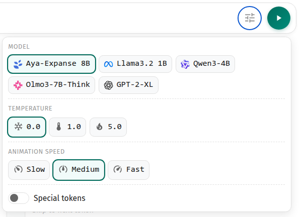
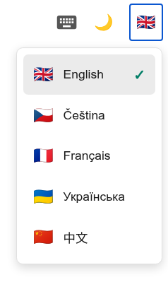

# Jak používat aplikaci

Jsi učitel, student nebo jen náhodný kolemjdoucí? 

Vítej! V tomto krátkém přehledu dozvíš, co tato aplikace umí a jak ji co nejlépe využít.

## K čemu aplikace je?

**Pojďme začít tím, co AnimatedLLM není**.

AnimatedLLM (aspoň zatím!) není kompletní výukovou aplikací, která Tě provede fungováním velkých jazykových modelů od začátku do konce.

Pro pochopení celého tématu budeš muset sáhnout i po dalších materiálech. 

Pro začátek zkus například toto krátké video z kanálu [3Blue1Brown](https://www.youtube.com/@3blue1brown/videos) (anglicky, titulky v řadě jazyků):

<iframe width="560" height="315" src="https://www.youtube.com/embed/LPZh9BOjkQs?si=Nogb8BgfP9kL1DIa" title="YouTube video player" frameborder="0" allow="clipboard-write; encrypted-media; gyroscope; picture-in-picture; web-share" referrerpolicy="strict-origin-when-cross-origin" allowfullscreen></iframe>

Na internetu najdeš i řadu dalších materiálů. Mezi ty kvalitní patří tyto ilustrované blogposty od Jay Allamara:

- **[Illustrated GPT-2](https://jalammar.github.io/illustrated-gpt2/)**
- **[Illustrated Transformer](https://jalammar.github.io/illustrated-transformer/)**

Pro české studenty tu pak jsou univerzitní kurzy přímo zaměřené na velké jazykové modely:

- **MFF UK:** [Large Language Models (NPFL140)](https://ufal.mff.cuni.cz/courses/npfl140)
- **FIT ČVUT:** [Neural Language Models (NI-NLM)](https://bilakniha.cvut.cz/en/predmet8241006.html)
 
 
(Disclaimer: autor aplikace se na prvním předmětu podílí a druhý vede 😇)

**A k čemu tedy AnimatedLLM je?**

Animace v AnimatedLLM slouží především jako výuková pomůcka. Pomáhá vysvětlit principy fungování jazykových modelů, u kterých by jinak bylo potřeba zdlouhavě "mávat rukama" nebo kreslit na tabuli.

Například:
- Odkud pochází text vygenerovaný modelem?
- Co to znamená, že se model "trénuje na dokumentech"?
- Kde se přesně berou pravděpodobnosti příštího tokenu?
- atd.

Proč ale vůbec tyto postupy řešíme, jak jazykové modely vznikly a jaká je jejich role v komplexních službách jako ChatGPT, Gemini nebo Claude – to už je potřeba nastudovat jinde.

**Ještě jedno varování...**

Některé principy jazykových modelů jsou v AnimatedLLM zjednodušené. Ne příliš, ale některé technické detaily s ohledem na přehlednost chybí.

Pokud Tě zajímají právě tyto technické detaily, následující animace jdou mnohem víc do detailu architektury modelů:
- [llm-viz](https://bbycroft.net/llm)
- [Transformer Explainer](https://poloclub.github.io/transformer-explainer/)

## Jak aplikace funguje?

Animace v AnimatedLLM jsou **zaznamenané interakce se skutečnými jazykovými modely**.

To znamená dvě věci:
- Animace ukazují realistické chování skutečných jazykových modelů.
- Během samotých animací žádný jazykový model neběží, jen se přehrává záznam v prohlížeči.

### Jak byly záznamy pro animace vytvořeny?
Záznamy vznikly z menších otevřených jazykových modelů  z repozitáře [Hugging Face](https://huggingface.co/models). 

Modely běžely na univerzitním výpočetním clusteru pomocí frameworku [vLLM](https://github.com/vllm-project/vllm). Tento framework umožňuje sbírat i takové detaily, jako jsou pravděpodobnosti příštích tokenů.

Prompty a dokumenty byly vybrané tak, aby se na nich daly demonstrovat různé zajímavé fenomény (např. "proč modely neumí dobře počítat písmena?").

Data jsou k dispozici pro různé:
- modely,
- dekódovací teploty,
- jazyky.

Skripty pro generování záznamů najdeš [repozitáři projektu](https://github.com/kasnerz/animated-llm/tree/main/scripts/data-generation). 

Najdeš tam také skript, pomocí kterého si můžeš všechny aktuální záznamy ve formátu JSON [stáhnout a prozkoumat](https://github.com/kasnerz/animated-llm/blob/main/scripts/download_data.py).

### Jaká data v záznamech jsou?

⚠ Pozor, tyto informace se mohly mezitím částečně změnit.

#### Model
Aplikace obsahuje výstupy z těchto modelů:
- [CohereForAI/aya-expanse-8b](https://huggingface.co/CohereForAI/aya-expanse-8b)
- [meta-llama/Llama-3.2-1B-Instruct](https://huggingface.co/meta-llama/Llama-3.2-1B-Instruct)
- [Qwen/Qwen3-4B-Instruct-2507](https://huggingface.co/Qwen/Qwen3-4B-Instruct-2507)
- [allenai/Olmo-3-7B-Think](https://huggingface.co/allenai/Olmo-3-7B-Think)
- [openai-community/gpt2-xl](https://huggingface.co/openai-community/gpt2-xl)

Pro trénování je zároveň k dispozici i záznam z tzv. "vanilla Transformeru", tedy modelu s náhodně nastavenými vahami (model je postavený na architektuře `Llama-3.2-1B-Instruct`, ale to je jen technický detail).

#### Dekódovací teplota
Dekódovací teplota je číslo mezi 0-∞, která (zjednodušeně řečeno) určuje, jak náhodně se vybírají příští tokeny. 

Zatímco při teplotě blízko nule se s velkou pravděpodobností vybere ten nejpravděpodobnější token, při hodně vysoké teplotě už se na předpovědi modelu téměř neohlížíme a token vybíráme náhodně.

Přímo v aplikaci jsou záznamy k dispozici pro následující hodnoty teplot:
- 🧊 **0.0**: token se vybere vždy ten nejpravděpodobnější,
- 🌡 **1.0**: token se vybere náhodně na základě pravděpodobností z modelu,
- 🔥 **5.0**: token se vybere náhodně a pravděpodobnosti z modelu hrají jen malou roli.

#### Jazyk

Záznamy poskytujeme ve všech jazycích, které aplikace podporuje. Těmi momentálně jsou:

- 🇬🇧 angličtina
- 🇨🇿 čeština
- 🇫🇷 francouzština
- 🇺🇦 ukrajinština
- 🇨🇳 čínština

Jazyky byly vybrané tak, aby pokrývaly širší škálu jazykových rodin a písem. 

Máš zájem rozšířit aplikaci o další jazyky nebo opravit nějaké chyby? Skoč dolů na sekci "Jak můžu dát na aplikaci feedback?" 

⚠ Pozor: Kromě angličtiny a češtiny je překlad webu vytvořený automaticky právě pomocí velkých jazykových modelů.

## Jak aplikaci ovládat?
### Jak si vyberu konkrétní záznam?

1. Vyber si na úvodní obrazovce, jaký aspekt jazykových modelů tě zajímá.
2. Vyber si **model a teplotu** v nastavení. V některých animacích je toto nastavení viditelné přímo, někde se skrývá pod ikonou:

3. Vyber si **jazyk** přes ikonu vlajky. (V současnosti je změna jazyka záznamu spjatá s přepnutím jazyka celé aplikace):

4. Spusť animaci kliknutím na tlačítko "Play".

### Tip pro pokročilé

Animace se dá ovládat i pomocí klávesových zkratek. 

Místo tlačítka "Play" můžeš například animaci krokovat pomocí šipky vpravo, případně se pomocí šipky vlevo vracet o krok zpět.

A zkratek je mnohem víc! 

Všechny zkratky najdeš pod ikonou klávesnice:

## Jak můžu dát na aplikaci feedback?

Dotazy a nápady na vylepšení zasílej na **[diskuzní fórum na Githubu](https://github.com/kasnerz/animated-llm/discussions)**.

Pokud nemáš Github účet, můžeš také napsat přímo hlavnímu autorovi aplikace ([Zdeněk Kasner](https://kasnerz.github.io), e-mail najdeš na např. [zde](https://ufal.mff.cuni.cz/zdenek-kasner)).